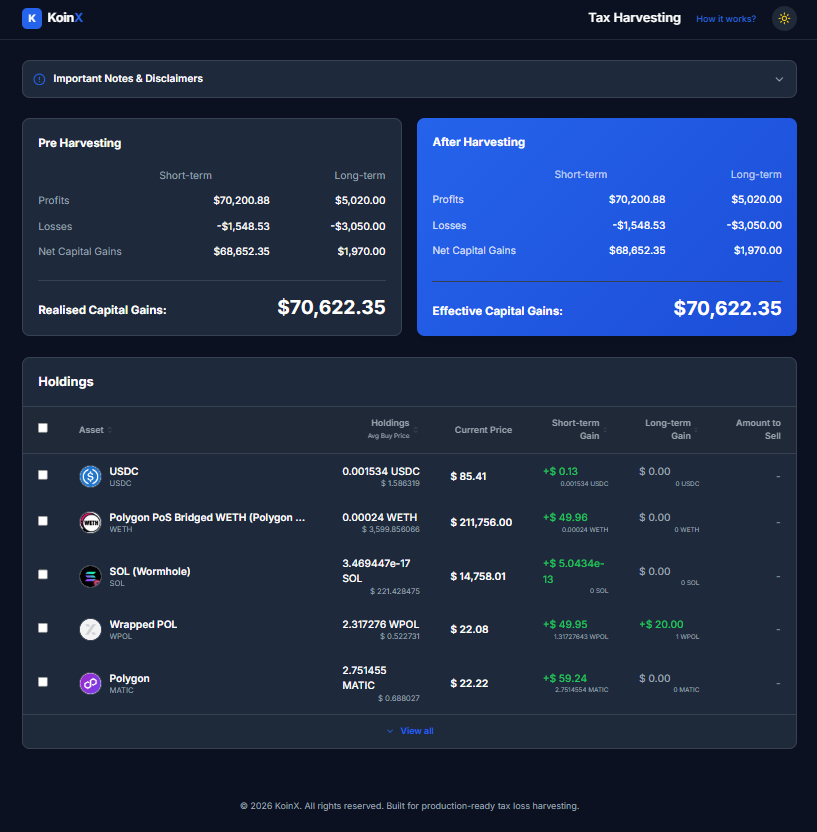
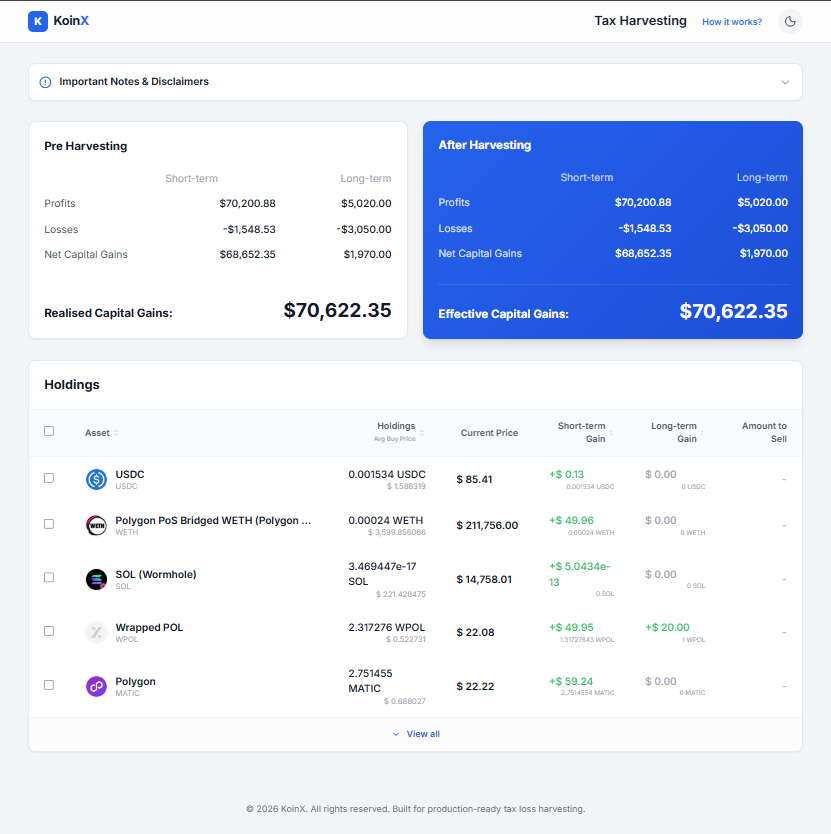

# 📊 Tax Loss Harvesting Dashboard

A high-performance, premium financial dashboard built to optimize tax liability through strategic asset harvesting. This application handles micro-cap assets with sub-atomic precision and provides a real-time "Before vs After" financial impact analysis.

## 🚀 Quick Start

### Prerequisites
- [Node.js](https://nodejs.org/) (v18 or higher recommended)
- npm (comes with Node.js)

### Installation
1. Clone or download the repository.
2. Navigate to the project directory:
   ```bash
   cd "Tax Loss Harvesting"
   ```
3. Install dependencies:
   ```bash
   npm install
   ```

### Running Locally
Start the development server:
```bash
npm run dev
```
Open [(https://tax-loss-harvesting-bay.vercel.app/)] in your browser to view the app.

---

## ✨ Key Features

- **Precision Math Engine**: Uses BigInt fixed-point arithmetic (18 decimal places) to ensure micro-transactions (e.g., `5.04e-13`) are accurately summed with large baseline values.
- **Micro-Value Tooltips**: Intelligent tooltips that show clean human-readable values for normal numbers but expand into full scientific precision for micro-assets.
- **Dynamic Calculation**: Real-time tax savings calculation across Short-term and Long-term capital gains.
- **Dual-Theme Glassmorphism**: Premium "Modern Industrial" aesthetic with fully reactive Light and Dark modes.
- **High-Contrast Inverse UI**: Tooltips automatically adopt an inverse theme (Dark popups in Light mode, White popups in Dark mode) for maximum readability.

---

## 📷 Screenshots

### 🌗 Dark Mode Dashboard


### 🌓 Light Mode Dashboard


---

## 📝 Assumptions & Logic

- **Precision Handling**: Floating-point math is insufficient for crypto assets. All calculations are performed by scaling values by `10^18`, performing operations on `BigInt`, and unscaling for the UI.
- **Tax Rules**: The engine assumes that Short-term losses can offset Short-term gains and Long-term losses can offset Long-term gains as per the current interactive model.
- **Data Source**: Current pricing and logos are fetched via the CoinGecko API mapping (mocked for consistency in this demo).
- **Default State**: To ensure user safety, the "Important Notes & Disclaimer" section starts collapsed, requiring intentional user engagement to read.

---

## 🛠️ Technology Stack

- **Framework**: React 19 (JavaScript)
- **Bundler**: Vite
- **Styling**: Tailwind CSS
- **Icons**: Lucide React
- **Math**: BigInt Fixed-Point (1e18)

---
© 2026 KoinX. Built for elite portfolio management.
